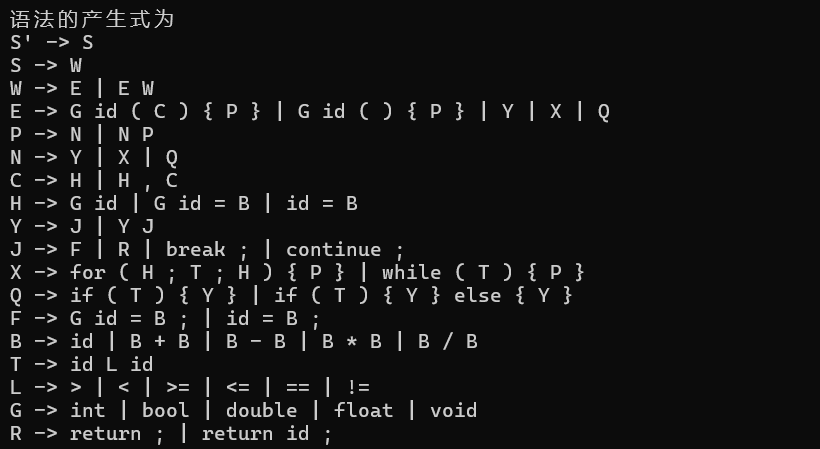
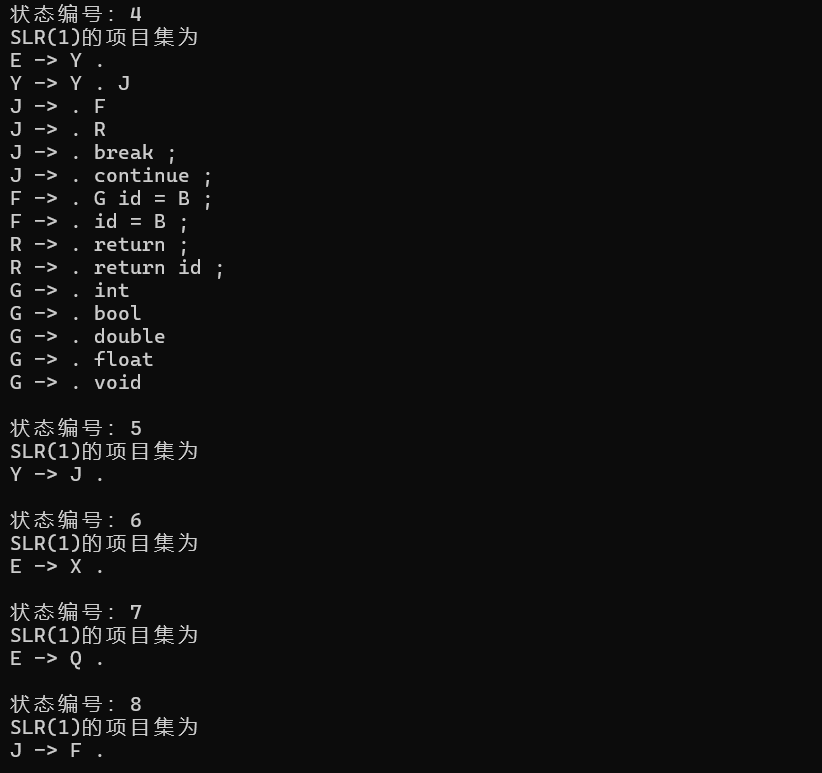
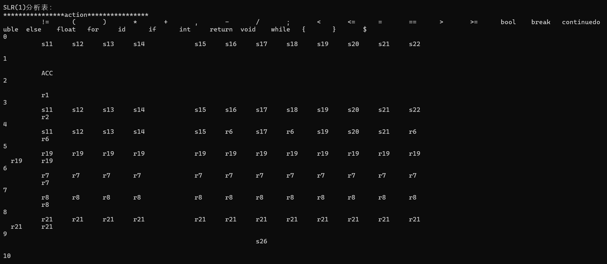
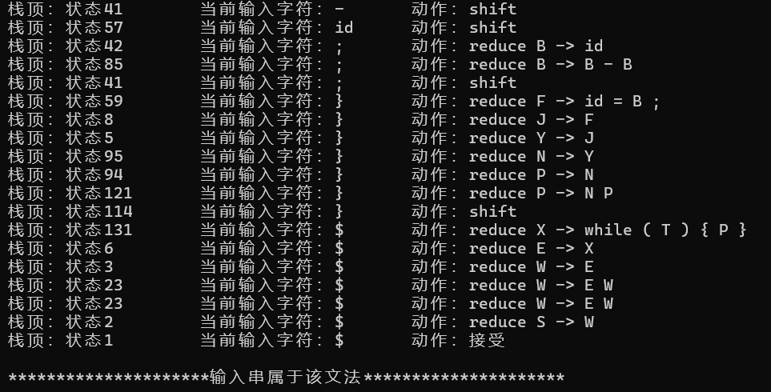

# SLR-SyntaxParser
编译原理实验--高级语言文法分析器

# 组成 
本项目由SLR类、Item类、tokenizer类 三个类构成
- SLR类：SLR语法分析器的具体实现，重要的函数有analysis、makeSLRtable、make_dfa
- Item类：为项目类，包含由产生式生成项目的函数等
- tokenizer类：为简易的词法分析器，效果是处理换行符、制表符和空格，以及将标识符和数字转换为 id
- 
# 文法和测试样例
- wenfa.txt 文件：保存类高级语言的文法实现
- 说明文档.txt 文件：保存对其中非终结符的说明
- test.txt 文件：为测试程序样例
- 
# 注意事项
本程序对 **空格** 十分敏感，测试程序中任何符号之间必须用 **空格分隔** ！！！

# 部分结果展示

